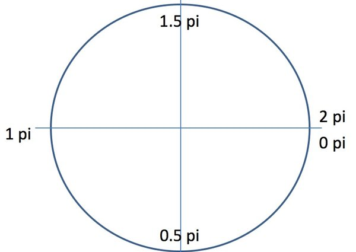

# Canvas 基础

学习 Canvas 基础用法时的一些总结和 Demo。

学习资源：[anvas: Draw on the web](https://yuque.com/airing/canvas/readme)

## 基础知识

`<canvas>` 标签在页面上定义了一个画布，提供了丰富的 JS API 来绘制图形。它本身只是一个容器，和其他 HTML 元素一样，可以添加属性、设置样式等。

在 canvas 上绘制，需要先获取到相应的 DOM，然后获取到相应的绘制上下文，接着利用上下文的 API 完成绘制。

获取画笔(2D)：`canvas.getContext("2d");`，当前唯一的合法值是 "2d"，它指定了二维绘图，在未来，如果 `<canvas>` 标签扩展到支持 3D 绘图，getContext() 方法可能允许传递一个 "3d" 字符串参数。

**Canvas是基于状态的绘制，意思是先设置画笔的各种状态，绘制路径等，然后执行绘制的方法进行绘制，如果多次调用绘制函数，之前设置的状态会被保留并且可以被覆盖。**

## 线段

### 移动画笔(moveTo())

`context.moveTo()`，将画笔移动到指定坐标。记住，这里是以 canvas 画布的左上角为笛卡尔坐标系的原点，且y轴的正方向向下，x轴的正方向向右。

### 笔画停点(lineTo())

同理，context.lineTo(600,600)。这句的意思是从 上一笔的停止点 绘制到(600,600)这里。

### 设置画笔属性

`context.lineWidth = 5`，这句话的意思是设置画笔(线条)的粗细为 5 px。
`context.strokeStyle = "#AA394C"`，这句话的意思是设置画笔(线条)的颜色为玫红色。

### 绘制

确定绘制只有两种方法，`fill()` 和 `stroke()`，前者是指填充，后者是指描边。

### 使用 beginPath() 开始绘制

为了让绘制方法不重复绘制，我们可以在每次绘制之前加上 `beginPath()`，代表下次绘制的起始之处为 `beginPath()` 之后的代码。

### 使用closePath()闭合图形

绘制路径的时候需要将规划的路径使用 `beginPath()` 与 `closePath()` 包裹起来。当然，最后一笔可以不画出来，直接使用`closePath()`，它会自动帮你闭合的。(所以如果你不想绘制闭合图形就不可以使用 `closePath()`)

### 使用rect()方法绘制矩形

由于绘制矩形是常用的方法，所以在Canvas API中已经帮我们封装好了一个绘制矩形的方法——rect()。这个方法接收4个参数x, y, width, height，实际调用时也就是 `context.rect(x,y,width,height);`

### 线条属性概述

#### lineCap

lineCap 定义上下文中线的端点，可以有以下 3 个值。
- butt：默认值，端点是垂直于线段边缘的平直边缘。
- round：端点是在线段边缘处以线宽为直径的半圆。
- square：端点是在线段边缘处以线宽为长、以一半线宽为宽的矩形。

#### lineJoin

lineJoin 定义两条线相交产生的拐角，可将其称为连接。在连接处创建一个填充三角形，可以使用 lineJoin 设置它的基本属性。

- miter：默认值，在连接处边缘延长相接。miterLimit 是角长和线宽所允许的最大比例(默认是 10)。
- bevel：连接处是一个对角线斜角。
- round：连接处是一个圆。


#### 线宽

lineWidth 定义线的宽度(默认值为 1.0)。

#### 笔触样式

strokeStyle 定义线和形状边框的颜色和样式。

## 填充

Canvas `fillStyle` 属性用来设置画布上形状的基本颜色和填充。fillStyle使用简单的颜色名称。这看起来非常简单，例如:

```js
context.fillStyle = "red";
```

### 渐变填充

在画布上创建渐变填充有两个基本选项：线性或径向。线性渐变创建一个水平、垂直或者对角线的填充图案。径向渐变自中心点创建一个放射状填充。填充渐变形状分为三步：添加渐变线，为渐变线添加关键色，应用渐变。下面是它们的一些示例。

#### 线性渐变

1. 添加渐变线：

```js
var grd = context.createLinearGradient(xstart,ystart,xend,yend);
```

渐变线起止点自定了了颜色变化的坐标区间，对应坐标点的图形会应用上对应的颜色。

2. 为渐变线添加关键色(类似于颜色断点)：

```js
grd.addColorStop(stop,color);
```

这里的stop传递的是 0 ~ 1 的浮点数，代表断点到(xstart,ystart)的距离占整个渐变色长度是比例。

3. 应用渐变

```js
context.fillStyle = grd;
context.strokeStyle = grd;
```

#### 绘制矩形的快捷方法

`fillRect(x,y,width,height)`、`strokeRect(x,y,width,height)`。这两个函数可以分别看做`rect()`与`fill()`以及`rect()`与`stroke()`的组合。因为rect`()`仅仅只是规划路径而已，而这两个方法确实实实在在的绘制。

### 径向渐变

1. 添加渐变圆：

```js
var grd = context.createRadialGradient(x0,y0,r0,x1,y1,r1);
```

2. 为渐变线添加关键色(类似于颜色断点)：

```js
grd.addColorStop(stop,color);
```

3. 应用渐变

```js
context.fillStyle = grd;
context.strokeStyle = grd;
```

**线性渐变是基于两个端点定义的，但是径向渐变是基于两个圆定义的。**

### 创建并填充图案

纹理其实就是图案的重复，填充图案通过`createPattern()`函数进行初始化。它需要传进两个参数`createPattern(img,repeat-style)`，第一个是Image对象实例，第二个参数是String类型，表示在形状中如何显示repeat图案。可以使用这个函数加载图像或者整个画布作为形状的填充图案。
有以下4种图像填充类型：

- 平面上重复：repeat;
- x轴上重复：repeat-x;
- y轴上重复：repeat-y;
- 不使用重复：no-repeat;

其实`createPattern()`的第一个参数还可以传入一个canvas对象或者video对象。

## 圆弧

### arc()

`context.arc(x,y,radius,startAngle,endAngle,anticlockwise)`

前面三个参数，分别是圆心坐标与圆半径。startAngle、endAngle使用的是弧度值，不是角度值。弧度的规定是绝对的。anticlockwise表示绘制的方法，是顺时针还是逆时针绘制。它传入布尔值，`true`表示逆时针绘制，`false`表示顺时针绘制，缺省值为`false`。



### arcTo()

`arcTo()`方法接收5个参数，分别是两个切点的坐标和圆弧半径。这个方法是依据切线画弧线，即由两个切线确定一条弧线。
具体如下。

`arcTo(x1,y1,x2,y2,radius)`

这个函数以给定的半径绘制一条弧线，圆弧的起点与当前路径的位置到(x1, y1)点的直线相切，圆弧的终点与(x1, y1)点到(x2, y2)的直线相切。因此其通常配合`moveTo()`或`lineTo()`使用。其能力是可以被更为简单的arc()替代的，其复杂就复杂在绘制方法上使用了切点。

## 贝赛尔曲线

[参考链接](https://blog.csdn.net/themagickeyjianan/article/details/54861945)

### 二次贝塞尔曲线

在Canvas里，二次贝塞尔曲线的方法如下。

```js
context.quadraticCurveTo(cpx,cpy,x,y);
```

起点为当前画笔的坐标，(cpx,cpy) 为控制点，(x,y) 为终止点。

[(在线)二次贝塞尔曲线）](http://blogs.sitepointstatic.com/examples/tech/canvas-curves/quadratic-curve.html)

### 三次贝塞尔曲线

绘制三次贝塞尔曲线代码如下。

```js
context.bezierCurveTo(cp1x,cp1y,cp2x,cp2y,x,y);
```

根据之前的结论，n阶贝塞尔曲线就有n-1个控制点，所以三次贝塞尔曲线有1个起始点、1个终止点、2个控制点。因此传入的6个参数分别为控制点cp1 (cp1x, cp1y)，控制点cp2 (cp2x, cp2y)，与终止点 (x, y)。

[(在线)三次贝塞尔曲线](http://blogs.sitepointstatic.com/examples/tech/canvas-curves/bezier-curve.html)

## 图形转换

### 平移

`context.translate(100,100)`

两个参数是画布平移后，在新画布上的坐标。平移相当于是移动画布。

**如果连续进行平移，效果会累加**。因此在每次绘制前使用 `context.save()` 保存当前状态，绘制后使用`context.restore()`。

### 旋转

`context.rotate(x)` 

其中 x 为旋转的弧度，这个的旋转是以坐标系的原点（0，0）为圆心进行的顺时针旋转。所以，在使用rotate()之前，通常需要配合使用translate()平移坐标系。

### 缩放

`context.scale(sx, sy)` 

两个参数分别是水平方向和垂直方向上对象的缩放倍数。

1. 缩放时，图像左上角坐标的位置也会对应缩放。
2. 缩放时，图像线条的粗细也会对应缩放。

缩放并非缩放的是图像，而是整个坐标系、整个画布！就像是对坐标系的单位距离缩放了一样。